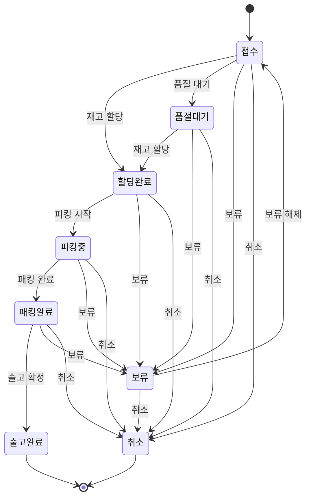

# PickFlow

주문 접수부터 출고까지를 관리하는 풀필먼트 운영 콘솔. 웹 관리자 화면 + 창고 현장용 모바일 화면.

> 진행 중인 포트폴리오 프로젝트입니다. 성과 지표와 데모 주소는 완성 후 채웁니다.
> 설계 문서: [docs/기획서.md](docs/기획서.md) · 작업 규칙: [AGENTS.md](AGENTS.md)

---

## 로컬 실행

### 1. 요구 사항

| 항목            | 버전          | 비고                                         |
| --------------- | ------------- | -------------------------------------------- |
| Node.js         | 22 이상       |                                              |
| pnpm            | 9 이상        |                                              |
| Oracle Database | **23ai 이상** | 스키마 스크립트가 `IF NOT EXISTS` DDL을 쓴다 |

### 2. 환경변수

`.env.example`을 `.env.local`로 복사해 값을 채운다. `.env.local`은 커밋되지 않는다.

```bash
cp .env.example .env.local
```

로컬 Oracle Database Free 기준 접속 문자열은 아래와 같다.
**CDB(`FREE`)가 아니라 PDB(`FREEPDB1`)에 붙어야 한다.**

```
ORACLE_CONNECT_STRING=localhost:1521/FREEPDB1
```

`ORACLE_WALLET_DIR`에 값이 있으면 클라우드(지갑) 접속으로 자동 전환된다. 코드는 고치지 않는다.

### 3. 스키마 생성

`db/schema/`의 스크립트를 **번호 순서대로** 실행한다. 순서를 지키지 않으면 외래키가 참조할 테이블이 없어 실패한다.

| 순서 | 파일               | 내용                                                |
| ---- | ------------------ | --------------------------------------------------- |
| 1    | `01_tables.sql`    | 테이블 12개 + 외래키 + CHECK 제약                   |
| 2    | `02_indexes.sql`   | 필수 인덱스 4개 + 외래키 인덱스                     |
| 3    | `03_sequences.sql` | 주문번호·웨이브번호 채번 시퀀스                     |
| —    | `99_drop_all.sql`  | **개발용 초기화.** 전체 삭제. 운영 DB에서 실행 금지 |

```bash
sqlplus PICKFLOW/비밀번호@localhost:1521/FREEPDB1 @db/schema/01_tables.sql
sqlplus PICKFLOW/비밀번호@localhost:1521/FREEPDB1 @db/schema/02_indexes.sql
sqlplus PICKFLOW/비밀번호@localhost:1521/FREEPDB1 @db/schema/03_sequences.sql
```

세 스크립트 모두 **두 번 실행해도 깨지지 않는다.** 이미 있는 객체는 건너뛴다.

처음부터 다시 만들려면 `99_drop_all.sql`을 먼저 돌리고 1 → 2 → 3을 다시 실행한다.

> **윈도우 한글 환경 주의.** `NLS_LANG`이 설정돼 있지 않으면 sqlplus가 스크립트의 한글을
> 잘못 읽어 `ORA-01756`(문자열이 종료되지 않음)으로 실패할 수 있다. 실행 전에 아래를 설정한다.
>
> ```
> set NLS_LANG=KOREAN_KOREA.AL32UTF8
> ```

### 4. 개발 서버

```bash
pnpm install
pnpm dev
```

DB 연결 상태는 <http://localhost:3000/api/health> 에서 확인한다.

```json
{ "status": "ok", "db": { "connected": true, "elapsedMs": 2 } }
```

연결에 실패하면 `503`과 함께 원인(ORA 코드)과 다음에 할 일을 함께 돌려준다.

---

## 명령어

| 명령             | 하는 일                                                        |
| ---------------- | -------------------------------------------------------------- |
| `pnpm dev`       | 개발 서버                                                      |
| `pnpm build`     | 프로덕션 빌드 (개발 서버를 먼저 내릴 것 — 같은 `.next`를 쓴다) |
| `pnpm typecheck` | 타입 검사                                                      |
| `pnpm lint`      | 린트                                                           |
| `pnpm format`    | 포맷 정리                                                      |

커밋하면 `typecheck` → `lint-staged`가 자동으로 돈다.

### 하네스

검증·데이터 생성 스크립트는 `harness/`에 독립 실행 스크립트로 둔다.
앱 코드를 import하지 않으므로 앱이 떠 있지 않아도 돌아간다.

| 명령                      | 하는 일                                                                        | 합격 기준                |
| ------------------------- | ------------------------------------------------------------------------------ | ------------------------ |
| `pnpm harness:seed`       | 본 시드. 상품 5천 / 로케이션 2천 / 재고 1만 / 주문 10만 / 주문상품 25만        | 5분 이내, 재고 합계 일치 |
| `pnpm harness:seed-small` | 개발 확인용 소량 데이터 (상품 20 / 로케이션 30 / 재고 50 / 주문 10 / 사용자 4) | 건수 일치                |
| `pnpm harness:perf`       | Playwright로 목록 화면 성능 측정                                               | 아래 기준 표             |

```bash
# 규모를 바꾸려면 인자로 넘긴다
pnpm harness:seed -- --orders 20000 --batch 5000
pnpm harness:seed-small -- --products 50 --orders 100
```

**측정값** (로컬 Oracle Database Free 23ai, 위 기본 옵션)

| 항목                           | 결과                                | 기준  |
| ------------------------------ | ----------------------------------- | ----- |
| 주문 10만 + 주문상품 25만 생성 | **17~27초**                         | 300초 |
| 재현성                         | 두 번 실행 시 데이터 해시 완전 일치 | —     |

결과는 `harness/results/YYYY-MM-DD-seed.json`에 남고 커밋한다.

> **시드는 할당 이전 상태를 만든다.** `INVENTORY.QTY_ALLOCATED`는 전부 0이다.
> 재고 할당은 PL/SQL 프로시저를 거쳐야만 하므로(AGENTS.md 절대 규칙) 시드가
> 할당된 척하는 데이터를 만들어두지 않는다. 여기에 임의의 값을 넣으면 정합성 조건 3
> (상품별 `ORDER_ITEMS.ALLOCATED_QTY` 합계 = `INVENTORY.QTY_ALLOCATED` 합계)이
> 처음부터 깨진다.

- **실행할 때마다 기존 데이터를 전부 지우고 다시 넣는다.**
- 시드값이 고정돼 있어 같은 옵션이면 항상 같은 데이터가 나온다.
- 접속 대상이 `localhost`가 아니면 실행을 거부한다.
  의도한 것이라면 `HARNESS_ALLOW_REMOTE=1`을 설정한다.
- 건수가 맞지 않으면 종료 코드 1로 끝난다.

TypeScript는 Node 22의 타입 스트리핑으로 그대로 실행한다. 별도 빌드나 `tsx`가 필요 없다.
그래서 `harness/` 안의 import는 `.ts` 확장자를 붙여야 한다.

### 성능 측정

**반드시 프로덕션 빌드를 향해 실행한다.** 개발 서버는 요청마다 컴파일해서 실제보다
몇 배 느리게 나온다.

```bash
pnpm build && pnpm start     # 다른 터미널
pnpm harness:perf
pnpm harness:perf -- --url https://데모주소 --repeat 5
```

측정 조건: 프로덕션 빌드, 주문 10만 · 주문상품 25만, Chromium 1440×900, 5회 반복.

| 항목                    |         개선 전 |         개선 후 | 기준    |
| ----------------------- | --------------: | --------------: | ------- |
| **목록 첫 렌더**        | 294 / **476**ms | 139 / **227**ms | ≤ 300ms |
| 스크롤 프레임           |  60.6 / 60.6fps |  60.2 / 62.1fps | ≥ 55fps |
| 필터 적용 응답          |       59 / 69ms |      96 / 111ms | ≤ 500ms |
| API 기본 목록           |   28.5 / 29.6ms |  64.9 / 109.7ms | ≤ 500ms |
| API 필터 조회           |   18.7 / 20.3ms |     19.4 / 30ms | ≤ 500ms |
| API 깊은 페이지(1500쪽) | 170.2 / 179.5ms | 179.2 / 250.7ms | ≤ 500ms |

<small>각 칸은 `중앙값 / p95`. 개선 전에는 목록 첫 렌더가 p95 476ms로 기준 미달이었다.</small>

측정 방식에서 정해둔 것:

- **평균을 쓰지 않는다.** 한 번 크게 튄 값을 평균이 숨긴다. 중앙값(보통 이 정도)과
  p95(나쁠 때 이 정도)를 함께 본다. **합격 판정은 p95로** 한다.
- **워밍업을 따로 두지 않는다.** 첫 회의 비용도 사용자가 겪는 시간이다.
- **첫 렌더는 전체 문서 이동으로 잰다.** 가장 불리한 경로이고, 봐주는 구석이 없다.
- 기준에 미달하면 **종료 코드 1**로 끝난다. 사람이 눈으로 판정하지 않는다.

#### 무엇을 고쳤나 (문제 → 원인 → 해결 → 수치)

**문제.** 목록 첫 렌더 p95가 476ms로 기준(300ms)을 넘었다.

**원인.** 추측하지 않고 브라우저의 Navigation·Resource Timing으로 분해했다.

```
첫 렌더 284ms (중앙값)
├ 문서 요청            63ms
├ JS 파싱·하이드레이션  30ms   → 여기까지 93ms
└ API 호출            56~150ms   ← 93ms 시점에야 시작
```

데이터를 클라이언트에서 가져오니 **문서 → JS → 하이드레이션 → API → 렌더**가 순서대로
줄을 섰다. SQL은 범인이 아니었다. `size`를 50·100·200으로 바꿔도 28~32ms로 같았고,
API 요청의 구간을 쪼개 보니 서버 처리는 49ms인데 메인 스레드가 하이드레이션으로 바쁜
동안 요청 발행이 106ms, 응답 처리가 120ms까지 밀렸다.

**해결.** 첫 페이지를 서버 컴포넌트에서 미리 조회해 화면에 넘긴다. 문서가 도착한 순간
이미 행이 들어 있으므로 첫 화면 경로에서 API 왕복이 사라진다. 스크롤로 다음 페이지를
받는 동작은 그대로다. API 라우트와 서버 컴포넌트는 `lib/orders/server.ts`의 같은 함수를
쓴다. 각자 조회하면 응답 모양이 갈라져 화면이 두 데이터를 다르게 그리게 된다.

**수치.** 첫 렌더 중앙값 294 → 139ms, p95 476 → 227ms. 재측정에서 첫 렌더 중
API 호출 수는 0건이다.

```
개선 전  문서 63ms → JS·하이드레이션 30ms → API 시작 93ms → API 종료 247ms = 284ms
개선 후  문서 75ms (TTFB 61ms, 서버가 쿼리) → 행이 이미 들어 있음          = 131ms
```

**대가도 적는다.** 서버가 문서를 만들면서 쿼리하므로 TTFB가 29 → 61ms로 늘었고,
필터를 바꿀 때도 서버를 한 번 거치게 되어 필터 응답이 59 → 96ms가 됐다.
둘 다 기준(500ms) 안이고, 첫 렌더에서 얻은 150ms가 훨씬 크다.

### 데모 계정

`harness:seed-small`이 만드는 계정. 비밀번호는 전부 `demo1234`.

| 역할     | 계정           |
| -------- | -------------- |
| ADMIN    | admin@demo.io  |
| OPERATOR | ops@demo.io    |
| PICKER   | picker@demo.io |
| VIEWER   | viewer@demo.io |

---

## 인증과 권한

Auth.js(Credentials) + 자체 `USERS` 테이블. 비밀번호는 bcrypt 해시로만 저장한다.
세션은 JWT이며 사용자 id와 역할을 담는다.

역할·권한 정의는 `lib/auth/roles.ts` **한 곳에만** 둔다. 화면과 서버가 같은 정의를 본다.

### 두 겹으로 막는다

| 계층      | 파일                | 하는 일                                           |
| --------- | ------------------- | ------------------------------------------------- |
| 미들웨어  | `middleware.ts`     | 비로그인 **화면** 접근을 `/login`으로 돌린다      |
| 서버 가드 | `lib/auth/guard.ts` | **API**에서 역할을 검사해 401/403을 JSON으로 반환 |

미들웨어는 `/api/*`를 일부러 건드리지 않는다. API 호출에 HTML 로그인 페이지가
돌아오면 부르는 쪽이 처리할 수 없기 때문이다. API는 예외 없이 가드를 거친다.

```ts
const guard = await requirePermission("user:manage");
if (!guard.ok) return guard.response; // 401 또는 403
```

**화면에서 버튼을 숨기는 것은 권한 처리가 아니다.** 브라우저 콘솔에서 `fetch` 한 줄이면
그대로 호출된다. 실제로 확인한 결과는 아래와 같다.

| 호출자   | `GET /api/users`                          |
| -------- | ----------------------------------------- |
| 비로그인 | `401 UNAUTHENTICATED`                     |
| PICKER   | `403 FORBIDDEN` — `user:manage` 권한 없음 |
| ADMIN    | `200`                                     |

### 메뉴와 경로

콘솔 메뉴는 `lib/nav.ts`에서 역할이 아니라 **권한**에 매단다. 역할을 직접 적으면
(`role === "ADMIN"`) 나중에 권한이 바뀔 때 메뉴와 서버 검사가 서로 다른 곳에서 갈라진다.

메뉴를 숨기는 것만으로는 부족해서 주소를 직접 입력한 경우도 미들웨어에서 막는다.

| 역할     | 보이는 메뉴                    | `/users` 직접 접근 |
| -------- | ------------------------------ | ------------------ |
| ADMIN    | 7개 전부                       | 통과               |
| OPERATOR | 대시보드·주문·재고·웨이브·패킹 | 대시보드로 되돌림  |
| VIEWER   | 대시보드·주문·재고·웨이브      | 대시보드로 되돌림  |
| PICKER   | 없음 (모바일 피킹 전용)        | 대시보드로 되돌림  |

대시보드(`/`)만 경로 권한 검사에서 제외한다. 되돌려 보낼 곳이 대시보드인데
대시보드까지 막으면 리다이렉트가 무한히 반복되기 때문이다.

---

## 주문 목록 API

`GET /api/orders` — 페이징·필터·정렬을 **전부 SQL에서** 처리한다. 10만 건을 브라우저로
내려보내 거르지 않는다.

| 파라미터        | 값                                                |
| --------------- | ------------------------------------------------- |
| `page` / `size` | 1부터 / 최대 200 (기본 50)                        |
| `status`        | 여러 번 지정 가능 (`status=RECEIVED&status=HOLD`) |
| `channel`       | 여러 번 지정 가능                                 |
| `q`             | 주문번호 또는 수취인 **앞부분 일치**              |
| `from` / `to`   | `YYYY-MM-DD`, 종료일 포함                         |
| `sort`          | `orderedAt:desc`(기본) `orderNo` `dueAt` `status` |

값은 전부 바인드 변수로 넘긴다. `IN` 목록도 `:status0`, `:status1`처럼 자리표시자를
개수만큼 만들어 붙인다. 정렬 컬럼은 바인드로 넘길 수 없어(SQL 구조라서) 허용 목록에
있는 값만 통과시킨다.

### 측정값 (프로덕션 빌드, 주문 10만 건, 11회 중 첫 회 제외)

| 조회                     |    중앙값 |   p95 |
| ------------------------ | --------: | ----: |
| 기본 1페이지             |  **32ms** |  53ms |
| 페이지 1000              |     140ms | 153ms |
| **페이지 2000 (마지막)** | **179ms** | 182ms |
| 채널 + 기간 필터         |      19ms |  22ms |
| 검색 (주문번호)          |      25ms |  53ms |
| 검색 (수취인)            |      23ms |  35ms |

기준은 500ms. 최악 케이스인 마지막 페이지도 179ms다.
페이지가 뒤로 갈수록 느려지는 것은 `OFFSET`이 그만큼의 행을 건너뛰어야 하기 때문이다.

### 실행 계획에서 확인한 것

`EXPLAIN PLAN`으로 확인한 뒤 고친 것이 하나 있다.

**상품 수 서브쿼리가 페이지가 아니라 전체 행에 대해 돌고 있었다.** 바깥 `SELECT`에
`(SELECT COUNT(*) FROM ORDER_ITEMS ...)`를 두면 `OFFSET/FETCH`로 자르기 전에 10만 행
전부에 대해 실행된다. 실행 계획 비용이 **2,676 → 299,000**으로 뛴다.
안쪽에서 50건을 먼저 고른 뒤 세도록 바꿔 서브쿼리가 50번만 돌게 했다.

인덱스는 기존 4개로 충분했다. `ORDERED_AT` 전용 인덱스와 `RECIPIENT_NAME` 인덱스를
만들어 봤지만 옵티마이저가 쓰지 않았고, 삭제 전후 응답 시간도 차이가 없어(24ms↔27ms)
넣지 않았다. **쓰이지 않는 인덱스는 삽입만 느리게 한다.**

> **통계 수집을 잊지 말 것.** 시드 직후에는 옵티마이저가 `ORDERS`를 10행짜리 테이블로
> 알고 있어 실행 계획이 의미가 없다. 대량 시드 뒤에는 반드시 아래를 실행한다.
>
> ```sql
> EXEC DBMS_STATS.GATHER_SCHEMA_STATS('PICKFLOW', cascade => TRUE);
> ```

---

## 데이터 모델

테이블 12개. 상세는 [docs/기획서.md](docs/기획서.md) 6장 참고.

```
USERS  PRODUCTS  LOCATIONS
  └ INVENTORY (PRODUCT_ID + LOCATION_ID 유니크)
ORDERS ─ ORDER_ITEMS
PICKING_WAVES ─ PICKING_TASKS
SHIPMENTS   INVENTORY_TRANSACTIONS   AUDIT_LOGS   IDEMPOTENCY_KEYS
```

**가용 재고는 저장하지 않는다.** 항상 `QTY_ON_HAND - QTY_ALLOCATED`로 계산한다.

정합성 조건 1·2(할당량은 실재고를 넘을 수 없고, 가용 재고는 음수가 될 수 없다)는
애플리케이션이 아니라 `INVENTORY` 테이블의 CHECK 제약이 직접 막는다.
앱 로직이나 프로시저가 틀려도 음수 재고는 저장되지 않는다.

---

## 상태 전이

정의는 `lib/order-graph.ts`의 전이 표 **한 곳에만** 둔다. 표를 고치면 셋이 함께 바뀐다.

1. 서버가 허용하는 전이 (`canTransition`)
2. 화면에 뜨는 액션 버튼 (`availableActions`)
3. 아래 다이어그램 (`toMermaid`)

손으로 그린 그림은 표가 바뀌면 조용히 거짓말이 된다. 그래서 그림도 표에서 뽑는다.

<!-- ORDER_GRAPH:START -->



<!-- ORDER_GRAPH:END -->

<small>마커 사이는 P26의 report 하네스가 갱신한다. 손으로 고치지 말 것.</small>

전이 18개. 각 전이에는 실행 가능한 역할, 사전 조건(guard), 따라붙는 훅(effects)이 함께 적혀 있다.

| 훅                        | 실행 시점                                           |
| ------------------------- | --------------------------------------------------- |
| `audit` (감사 로그)       | 트랜잭션 **안**. 실패하면 전체 롤백                 |
| `inventoryTx` (재고 이력) | 트랜잭션 **안**. 실패하면 전체 롤백                 |
| `emit` (실시간 이벤트)    | 커밋 **이후**. 롤백됐는데 알림만 나가는 것을 막는다 |

거부할 때는 사유를 함께 남긴다. "거부됨"만 기록하면 나중에 왜 막혔는지 알 수 없다.

```
RECEIVED → SHIPPED  : 접수에서 출고완료로는 바꿀 수 없습니다.
                      가능한 상태: 할당완료, 품절대기, 보류, 취소
SHIPPED → CANCELLED : 출고완료 주문은 더 이상 상태를 바꿀 수 없습니다.
ALLOCATED → PICKING : 피킹 시작은 ADMIN, OPERATOR 역할만 할 수 있습니다. 현재 역할: PICKER
```

`ORDERS.STATUS`의 CHECK 제약은 이 정의를 벗어난 값이 **저장되는 것**을 막는 마지막
방어선이다. 코드가 틀려도 DB에 이상한 상태가 남지 않는다.
